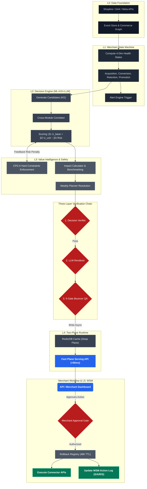

# CPG Decision Engine V3

> [!IMPORTANT]
> **Project Status: Architecture Validation & MVP Phase**
> This repository is currently in the foundational validation phase. Please note the following before reviewing:
> - **Data Availability:** We currently lack production commerce data; data pipelines run on deterministic stubs and mock state vectors to validate the architecture without requiring real PII or external DB connections.
> - **Knowledge Graph (KG) & Use Cases:** The underlying Domain KG and structural playbook variations (action templates) are still under construction.
> - **Review Focus:** The core value demonstrated in this repository is the **robustness of the 6-layer architecture**, the strict **3-layer Safety Verification Chain**, and the **Decision Engine execution flow**, rather than the breadth of data or ML inference accuracy.

CPG Decision Engine V3 is an **Operating Intelligence Layer** for CPG brands on Shopline. It ingests commerce signals (orders, ads, inventory), diagnoses merchant health across four dimensions, recommends verified actions with dollar-impact estimates, and presents them for human approval before execution. It is **not** a dashboard, **not** a chatbot, and **not** an auto-executor — it is a decision recommendation system that requires merchant confirmation at every step.

## Current Handoff Status

V3 is a validated architecture + MVP foundation, not yet a production-ready deployment. Core tests pass on synthetic data; no real merchant data or external API credentials are required for the test suite. Tests run on in-memory SQLite; local API deployment still requires Postgres/Redis config.

### Works Locally
- Full 16-step Decision Engine pipeline (Deep Plane)
- FastAPI backend with 10 endpoints (decision, approval, rollback, policy, health)
- Fast Plane cache-read serving path
- 400+ passing tests covering contracts, architecture invariants, and e2e fixtures
- KG playbook 3-layer routing (meta-patterns, brand bindings, use cases)
- BrightSkin end-to-end demo fixture

### Not Yet Productionized
- No production frontend connected to backend yet; static mockup exists in `mockup/`
- Shopline / Meta / GA4 data connectors are interface stubs
- External write APIs for action execution are not implemented
- Airflow DAGs are placeholder stubs (`pass` bodies)
- Reward backfill / learning loop is stubbed
- LLM renderer uses deterministic templates, not real LLM API
- `transition_id` type conflict: UUID in SQL vs int in Python (tracked as SPIKE-014-01)
- No CI/CD pipeline configured

### Recommended Next Steps
1. Docker full-stack deployment (Postgres + Redis + FastAPI)
2. Build/connect frontend to existing API endpoints
3. Implement real data connector (see ADR-0010)
4. Implement DAG scheduling (Airflow or cron)
5. Resolve SPIKE-014-01 (`transition_id` unification)
6. Integrate real LLM API
7. Set up CI/CD + lint + typecheck

### Key Architecture Docs for Onboarding
- `CLAUDE.md` — layer responsibilities and data contracts
- `docs/PHASE_ROADMAP.md` — what is done vs planned
- `docs/EVOLUTION_GUIDE.md` — how to make changes safely
- `docs/adr/` — ADR-0001 through ADR-0016, including proposed V3.1 ADRs
- `tests/architecture/` — automated architecture guardrails

## Governance
This project follows formal architecture governance:
- **Decisions**: documented in `docs/adr/`
- **Roadmap**: `docs/PHASE_ROADMAP.md`
- **Architecture reference**: `CLAUDE.md`
- **How to contribute**: `docs/EVOLUTION_GUIDE.md`

## 6-Layer Architecture

| Layer | Name | Description |
|-------|------|-------------|
| L0 | Signal Plane | Connectors (Shopline, Meta Ads, GA4) + Event Store + Commerce Graph. Data factualisation only — zero decision logic. |
| L1 | Merchant State Plane | 4 dimensions × 4 states (HEALTHY → WATCH → DEGRADING → CRITICAL) + Alert Engine. Routing state only — not a complete feature representation for ML. |
| L2 | Domain World Model | Typed world model (entities + relations) + evidence graph + candidate expansion context. Phase 1: playbook registry + commerce graph stubs. |
| L3 | Decision Core | 5 sub-modules in strict order: Candidate Proposal → Correlation & Conflict → Policy Evaluation (PolicyDecision) → Scoring & Ranking → Verification |
| L4 | Experience & Delivery Plane | Verified decisions → DecisionCard rendering → 5-Gate QA → cache serving. Deep Plane (async) + Fast Plane (<50ms, cache-only). |
| L5 | Learning Fabric | S/A/R/S' substrate — Decision Log, Execution Log, Outcome Log, Feature History. Not an execution layer. |

### L3 Decision Core — Sub-module Boundaries

| Sub-module | Input | Output | Key Type |
|-----------|-------|--------|----------|
| L3.1 Candidate Proposal | MSM states + KG/playbooks | Raw action candidates | `RawCandidate` |
| L3.2 Correlation & Conflict | RawCandidate[] | Filtered, de-conflicted | CrossModuleCorrelator |
| L3.3 Policy Evaluation | Candidate + constraints | Eligibility + weighted risk | `PolicyDecision` |
| L3.4 Scoring & Ranking | Candidate + PolicyDecision | Ranked by β formula | `ScoredCandidate` |
| L3.5 Verification | Top-K scored | Verified or -inf | DecisionVerifier |

### Architecture Execution Flow




## Three-Layer Verification Chain

Every recommended action passes through three sequential gates before reaching the merchant:

1. **DecisionVerifier** (Layer 2) — Validates MSM trigger, margin gate, inventory gate, and conflict check. If any step fails, the action receives `final_score = -inf` and is **never** sent to the LLM renderer.
2. **LLM Renderer** (Layer 2) — Translates the verified decision into merchant-facing language (diagnosis, recommendation, impact narrative). Phase 1 uses deterministic templates; Phase 2+ uses LLM API. Raises `ValueError` if called with a failed verification.
3. **5-Gate Bouncer** (Layer 2) — Output QA: schema validation, policy echo, no raw numerics, copy safety, and evidence grounding. Failure blocks the API response but does **not** block WSM logging — the decision was valid, only the expression failed QA.

This chain ensures that no unverified decision is ever rendered, and no poorly-expressed decision is ever shown to a merchant — while still preserving the full decision trace in the World State Model for learning.

## Architecture Notes

**PolicyDecision — unified constraint interface**

`ConstraintEngine.check_all()` returns a `PolicyDecision` object (L3.3), replacing the former split between a `tuple[bool, list[str]]` and a separate `float` from `compute_risk_score()`. `PolicyDecision` carries:
- `eligible` / `hard_reject` — gate signal
- `violations` — typed list in `"constraint_name:detail"` format
- `risk_penalty` — weighted sum (margin_floor=3.0, inventory_gate=2.5, incrementality=2.0, etc.), not a raw count

`PolicyDecision.risk_penalty` feeds the β3·Risk term directly:

```
Score = β1·U_base + β2·U_ucb − β3·Risk(Constraints)
```

Safety enforcement is its primary identity (L3). Penalty signal is its secondary role (consumed by L3.4 scoring). `ConstraintEngine` still lives in `layer3_value/` — see `CLAUDE.md` for the cross-layer dependency note.

**Scoring Formula (LinUCB — Li et al. 2010 WWW)**

β weights are set dynamically by PolicyPack (never hardcoded). Phase 1 cold-start: `u_ucb = 0.0` when bandit has no data, reducing the formula to `Score = β1·U_base − β3·Risk`.

**Two-Plane Runtime**

- **Deep Plane**: Runs the full 16-step pipeline asynchronously (weekly planner + 6h ranking refresh). No latency SLA.
- **Fast Plane**: Serves every API request from pre-computed cache. Fallback chain: Redis → DB → 503. **Never** recomputes decisions. **Never** calls `pipeline.run_once()`. Latency target: <50ms p99.

## Quick Start

### 1. Architecture Validation (Current Stage)
The V3 architecture is fully validated using an in-memory SQLite database. You can verify all strictly-ordered constraints and decision logic independently:

```bash
# Install dependencies
pip install -e ".[dev]"

# Run 100+ architecture verification tests (No Postgres/Redis required)
python -m pytest tests/
```

### 2. Phase 1 Deployment (WIP)
(Note: The following steps require configuring `.env` credentials for the infrastructure)

```bash
# Start infrastructure (Postgres + Redis)
docker-compose up -d

# Start API server 
uvicorn api.app:app --reload --port 8080
```

## Technical Design Rationale

This section details the ML architecture constraints, Safe RL tradeoffs, and engineering decisions made to bridge academic RL theory with the severe latency/safety constraints of B2B CPG commerce.

### 1. Scoring Model Selection — Why LinUCB?
The objective function balances domain-expert priors against dynamic bandit exploration: `Score = β1·U_base(KG) + β2·U_ucb(Bandit) − β3·Risk(Constraints)`.
A senior ML practitioner might ask: *Why LinUCB (Li et al. 2010 WWW)? Why not Thompson Sampling or an over-parameterized Contextual Transformer?*
*   **Curse of Dimensionality mitigation:** We discretize continuous merchant signals (e.g., exact CAC ratio) into an intentionally coarse 4-dimension × 4-state `Merchant State Vector` (e.g., *Acquisition: DEGRADING*). This aggressive abstraction bounds the contextual state space, drastically reducing the sample complexity required for convergence.
*   **Controllable Variance vs. Thompson Sampling:** In B2B SaaS, unconstrained exploration is dangerous. Thompson Sampling's probabilistic selection can cause erratic behavior for the same merchant within a short window. LinUCB's deterministic upper bound allows strict reproducibility when debugging merchant traces.
*   **Explainable Context:** Every action's contextual weight ($\theta$) is linear, allowing deterministic, reverse-engineerable explanations of *why* an action won.

### 2. World State Model (WSM) as an RL Substrate
The system implements a valid S/A/R/S' Markov Decision Process logging substrate, but natively addresses the **Delayed Feedback (Credit Assignment)** challenge. Action payoffs in commerce (e.g., LTV lift, 30-day ROAS) take weeks to materialize.
*   **Proxy vs. Final Rewards (Temporal Difference approach):** At $T_0$, actions are logged identically. At $T_{+24h}$, a *Proxy Reward* (e.g., Add-To-Cart delta) updates the model for fast reactivity. At $T_{+30d}$, a *Final Reward* (e.g., actual ROI delta) overrides the trajectory, preventing catastrophic short-term bias.
*   **Counterfactual Logging (Off-Policy Correction):** Because every action passes through a `MerchantApprovalGate`, the *Behavior Policy* (what the merchant actually approved) often diverges from the *Target Policy* (what the DE recommended). We actively append a `Counterfactual` record summarizing the "next best action" to establish the baseline for future Inverse Probability Weighting (IPW) causal inference.

### 3. Safe RL Design — Soft Penalties vs. Hard Gates
The architecture deliberately decouples Soft Reward Shaping from Hard Operational Gates.
*   **Soft Penalty (`− β3·Risk`):** Risk calculation inside the scoring phase allows smooth, continuous penalization of suboptimal actions, shifting probability mass toward safer alternatives.
*   **Hard Gates (Safety Shell):** Regardless of how aggressively large the LinUCB exploration bound becomes, the winning output is sequentially fed into the deterministic `DecisionVerifier` (the safety shell). Any absolute violations (e.g., `margin_floor` breaches, or conflicting logic) aggressively forcefully override the outcome to `final_score = -inf`. This strictly prioritizes determinism over probability.

### 4. Phase Gate Thresholds — Exploration Data Bounds
Why is the Bandit actively suppressed (`u_ucb = 0.0`) in Phase 1?
The regret bound of an untrained contextual bandit is catastrophic when each "pull" represents spending real marketing budget. We enforce a passive shadow-logging phase until explicit statistical significance is achieved over the state distribution. Phase 1 logs priors, Phase 2 generates Proxy Rewards across the ecosystem, and Phase 3 dynamically activates the $\alpha$ multiplier only once empirical variance fits safely within risk budget limits.

### 5. Known Limitations and Open Problems

- **Non-stationarity**: Merchant behavior distribution shifts over promotion 
  seasons. The current WSM does not implement distribution shift detection. 
  A CUSUM-based drift detector on the MSM state transition matrix is planned 
  for Phase 3.

- **Reward sparsity**: In Phase 1, most WSM records have was_executed=False 
  (shadow mode). The bandit will train exclusively on approved actions, 
  introducing survivorship bias. Debiasing via logged bandit approaches 
  (Strehl et al. 2010) is a Phase 3 open problem.

- **Linear assumption boundary**: CrossModuleCorrelator handles explicit 
  cross-dimension interactions, but implicit non-linear merchant behavior 
  (e.g., seasonality × margin sensitivity) is not captured in the current 
  feature space.

## Phase 1 Status

### Already in V3 (pre-governance session)
- MerchantStateMachine + AlertEngine (L1)
- PlaybookRegistry + PolicyPack validation (L2 KG pillar)
- AnomalyDetector z-score proxy (L2 ML pillar, Phase 1)
- DecisionVerifier + LLMRenderer + 5-Gate Bouncer (L2 Safety pillar)
- ConstraintEngine (6 CPG hard constraints) + ImpactCalculator + MerchantApprovalGate + RollbackRegistry (L3)
- pipeline.py Deep Plane (16-step) + fast_plane.py + redis_cache.py + rollout.py (L4)
- wsm_client.py + reward_backfill.py + telemetry_audit_logger.py (L5 stubs)

### Added in V3.5 contract upgrade session (2026-04-09, Part 1)
- `PolicyDecision` unified interface replacing `(bool, list[str])` + separate float
- `DecisionFeatureVector`, `DecisionState` typed contracts
- `RawCandidate`, `ScoredCandidate` Pydantic models with `frozen=True`
- Weighted `risk_penalty` in `ConstraintEngine` (`_VIOLATION_WEIGHTS` dict)
- `scoring.py` consumes `PolicyDecision` directly — eliminated duplicate `check_all()` call

### Added in V3.5 governance session (2026-04-09, Part 2)
- ADR framework with 8 ADRs (6 retroactive + ADR-0007 cross-layer + ADR-0008 LinUCB)
- `docs/PHASE_ROADMAP.md` — single source of truth for Phase 1/2/3 work
- `docs/EVOLUTION_GUIDE.md` — 5-step change process for future contributors
- `tests/contracts/` — 5 contract test files enforcing typed object invariants
- `tests/architecture/test_architecture_invariants.py` — 8 invariant tests detecting drift
- `feature_plane/builder.py` — `FeatureBuilder` implementation, wired into `pipeline.py`
- `fixtures/brightskin/` + `tests/e2e/test_brightskin_walkthrough.py` + `scripts/demo_brightskin.py`
- `CLAUDE.md` / `README.md` cross-references and governance section

**Test suite**: 314 tests, all green (starting baseline: 161 tests).

### Phase 1 Scope Limitations (by design, not gaps)
Phase 1 intentionally uses stub connectors and template rendering. The following are
**Phase 2 Track A deliverables**, not Phase 1 gaps:

- Real Shopline data connector — Phase 2 Track A
- Real LLM API integration — Phase 2 Track A
- Real external write APIs (discounts, campaigns) — Phase 2 Track A

Phase 1 is considered complete when architecture, governance, contracts, and tests
are stable. Shadow mode (`was_executed=False`) is a Phase 1 feature, not a
limitation. No real merchant data or external API calls are required for Phase 1
validation.

---

## Phase Roadmap

### Phase 1 — Active Now
- Shadow mode: all decisions logged with `was_executed=False`, no external execution
- Deterministic LLM rendering (template-based, no API calls)
- MSM health computation across 4 dimensions with configurable thresholds
- Full verification chain (DecisionVerifier → Renderer → 5-Gate)
- ImpactCalculator using industry benchmark priors (confidence ≤ 30%)
- RollbackRegistry with 48h TTL for all write actions
- MerchantApprovalGate enforcing human confirmation
- Weekly planning with conflict detection

### Phase 2 — Activation (First Paying Customers + Knowledge Layer)

Two parallel tracks that must converge before Phase 3.

**Track A · Commercial Activation** *(blocks first paying customer)*
- Shopline data connector: orders, inventory, catalog → real MSM signal computation
- LLM API integration: replace DeterministicRenderer with real merchant copy
- Web Dashboard + one-click approval workflow (was_executed transitions from False → True)
- Shopline write API: execute approved actions (retention discounts, reminder campaigns)
- ImpactCalculator upgraded: as WSM outcomes accumulate, confidence scales above 30% → RECOMMENDATION cards auto-promoted
- Multi-merchant BenchmarkEngine: peer comparison once 2+ merchants in production
- Performance billing activation: 10% of outcome_delta (requires 30-day reward cycle)

**Track B · KG Knowledge Layer** *(partner-dependent, parallel to Track A)*
- Partner Playbook YAML translation: domain expert content → typed graph facts in `playbook_registry`
- L3 physical sub-module split: `pipeline.py` decomposed into 5 discrete files matching L3.1–L3.5
- Multi-merchant test fixture: deterministic multi-brand signal sets for regression testing
- `DecisionFeatureVector` wired into scoring: replaces raw `signals` dict as bandit context contract

*Track B has no hard dependency on Track A — it advances as partner content is delivered.*

### Phase 3 (6–12 months) — Learning at Scale

Prerequisites: Track A complete (real execution data), 6+ months of action_log with outcomes.

**Signal Completeness**
- Meta Ads connector: campaign spend, ROAS, CPM → real acquisition dimension signals
- GA4 connector: session CVR, funnel drop-off → real conversion dimension signals
- `DecisionFeatureVector` fully populated from live connectors (no more benchmark fallbacks)

**Learning Fabric**
- WSM table split: single `wsm_transitions_v3` → 4 tables (Decision Log / Execution Log / Outcome Log / Feature History)
- Offline evaluation framework: backtesting pipeline, holdout-based validation, counterfactual replay
- LinUCB bandit activation: `u_ucb` term goes live once arm pull count crosses significance threshold
- CUSUM drift detector on MSM state transition matrix (non-stationarity guard)

**KG Completion**
- Document compiler: partner domain documents → three-way split (graph facts → KG / policy candidates → policy bundle / retrieval chunks → renderer)
- Evidence graph: metric shift → action support links (which signal triggered which candidate)
- `CorrelatedCandidate` typed Pydantic model (replaces dict in CrossModuleCorrelator output)

**Scaling**
- Shopline ecosystem embed + REST API
- Holdout-based billing validation (outcome_delta attribution audited against control group)

## Phase 2 Track A Deliverables (Not Phase 1 Scope)

The following are intentionally deferred to Phase 2 Track A. They are not Phase 1
gaps — Phase 1 validates architecture and governance using stubs and deterministic
templates. Real data and APIs activate at Phase 2.

- **Real Shopline data connector** — orders/inventory/catalog → real MSM signal computation
- **Real LLM API connection** — DeterministicRenderer active in Phase 1; LLM API activates Phase 2
- **External write APIs** — Shopline + Ad platform connectors are stubs (Phase 2)
- **Multi-merchant BenchmarkEngine** — needs peer data from ≥2 production merchants (Phase 2)
- **3 new Playbook YAMLs** — content pending from partner (structural templates in Phase 1)

## V0/V2 → V3 Key Changes

- **4-dimension MSM** replaces V0's single-dimension retention-only risk model; each dimension has 4 states with configurable thresholds
- **Three-layer verification chain** (DecisionVerifier → LLM Renderer → 5-Gate) replaces V0's single LLM safety gateway
- **Two-Plane Runtime** (Deep + Fast) replaces V2's single synchronous pipeline; Fast Plane guarantees <50ms p99 via cache-only serving
- **ImpactCalculator with counterfactual** provides dollar-range estimates (conservative/expected/optimistic) instead of V2's point estimates
- **Cross-Module Correlator** detects and suppresses conflicting actions across dimensions (e.g., "don't increase ad budget when conversion is also degrading")
- **RollbackRegistry + MerchantApprovalGate** enforce "human confirmation before execution" as explicit standalone components (V2 had inline checks only)
- **WSM schema extended** with verification_chain, impact_estimate, counterfactual, urgency_score, module, msm_dimension, and msm_state fields for full decision traceability
