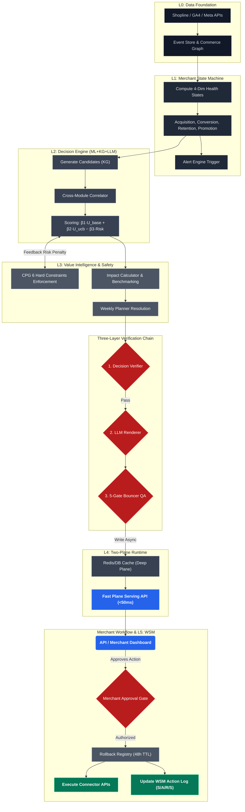

# CPG Decision Engine V3

CPG Decision Engine V3 is an **Operating Intelligence Layer** for CPG brands on Shopline. It ingests commerce signals (orders, ads, inventory), diagnoses merchant health across four dimensions, recommends verified actions with dollar-impact estimates, and presents them for human approval before execution. It is **not** a dashboard, **not** a chatbot, and **not** an auto-executor — it is a decision recommendation system that requires merchant confirmation at every step.

## 6-Layer Architecture

| Layer | Name | Description |
|-------|------|-------------|
| L0 | Data Foundation | Connectors (Shopline, Meta Ads, GA4) + Event Store + Commerce Graph |
| L1 | Merchant State Machine | 4 dimensions (acquisition, conversion, retention, promotion) × 4 states (HEALTHY → WATCH → DEGRADING → CRITICAL) + Alert Engine |
| L2 | Tri-Pillar Decision Engine | Knowledge Graph + ML Models + LLM Renderer, unified by Cross-Module Correlator and Scoring Engine |
| L3 | Value Intelligence | ImpactCalculator, BenchmarkEngine, FeedbackCollector, WeeklyPlanner, RollbackRegistry, MerchantApprovalGate, Constraints |
| L4 | Two-Plane Runtime | Deep Plane (async, weekly/6h cadence) + Fast Plane (sync, <50ms p99) |
| L5 | World State Model | S/A/R/S' learning substrate — every decision logged, outcomes backfilled |

### Architecture Execution Flow




## Three-Layer Verification Chain

Every recommended action passes through three sequential gates before reaching the merchant:

1. **DecisionVerifier** (Layer 2) — Validates MSM trigger, margin gate, inventory gate, and conflict check. If any step fails, the action receives `final_score = -inf` and is **never** sent to the LLM renderer.
2. **LLM Renderer** (Layer 2) — Translates the verified decision into merchant-facing language (diagnosis, recommendation, impact narrative). Phase 1 uses deterministic templates; Phase 2+ uses LLM API. Raises `ValueError` if called with a failed verification.
3. **5-Gate Bouncer** (Layer 2) — Output QA: schema validation, policy echo, no raw numerics, copy safety, and evidence grounding. Failure blocks the API response but does **not** block WSM logging — the decision was valid, only the expression failed QA.

This chain ensures that no unverified decision is ever rendered, and no poorly-expressed decision is ever shown to a merchant — while still preserving the full decision trace in the World State Model for learning.

## Architecture Notes

**Cross-Layer Dependency: constraints.py**

constraints.py is placed under Layer 3 (Action Safety) because its primary role is safety enforcement before execution. However, its outputs are also consumed by Layer 2 scoring as the Risk(Constraints) term in:

```
Score = β1·U_base + β2·U_ucb − β3·Risk(Constraints)
```

This is intentional. Safety enforcement is its primary identity (Layer 3). Penalty signal is its secondary role (consumed by Layer 2 scoring).

**Scoring Formula (LinUCB — Li et al. 2010 WWW)**

β weights are set dynamically by PolicyPack (never hardcoded). Phase 1 cold-start: `u_ucb = 0.0` when bandit has no data, reducing the formula to `Score = β1·U_base − β3·Risk`.

**Two-Plane Runtime**

- **Deep Plane**: Runs the full 16-step pipeline asynchronously (weekly planner + 6h ranking refresh). No latency SLA.
- **Fast Plane**: Serves every API request from pre-computed cache. Fallback chain: Redis → DB → 503. **Never** recomputes decisions. **Never** calls `pipeline.run_once()`. Latency target: <50ms p99.

## Quick Start

### 1. Architecture Validation (Current Stage)
The V3 architecture is fully validated using an in-memory SQLite database. You can verify all strictly-ordered constraints and decision logic independently:

```bash
# Install dependencies
pip install -e ".[dev]"

# Run 100+ architecture verification tests (No Postgres/Redis required)
python -m pytest tests/
```

### 2. Phase 1 Deployment (WIP)
(Note: The following steps require configuring `.env` credentials for the infrastructure)

```bash
# Start infrastructure (Postgres + Redis)
docker-compose up -d

# Start API server 
uvicorn api.app:app --reload --port 8080
```

## Phase Roadmap

### Phase 1 — Active Now
- Shadow mode: all decisions logged with `was_executed=False`, no external execution
- Deterministic LLM rendering (template-based, no API calls)
- MSM health computation across 4 dimensions with configurable thresholds
- Full verification chain (DecisionVerifier → Renderer → 5-Gate)
- ImpactCalculator using industry benchmark priors (confidence ≤ 30%)
- RollbackRegistry with 48h TTL for all write actions
- MerchantApprovalGate enforcing human confirmation
- Weekly planning with conflict detection

### Phase 2 — Activation
- Real LLM API integration for merchant copy rendering
- External write APIs for Shopline and ad platform execution
- Multi-merchant BenchmarkEngine with peer comparison data
- Web Dashboard with one-click approval workflow
- ImpactCalculator upgraded with WSM outcome history (confidence scales with data)
- Performance billing: 10% of outcome_delta

### Phase 3 (6–12 months) — Learning
- LinUCB bandit activation (requires 6 months of action_log with outcomes)
- Holdout-based billing validation
- Shopline ecosystem embed + REST API (Phase 3 delivery)

## What Is NOT Yet Implemented

- **3 new Playbook YAMLs** — content pending from partner (current playbooks are structural templates)
- **Real LLM API connection** — DeterministicRenderer active in Phase 1; LLM adapter is a stub
- **External write APIs** — Shopline and Ad platform connectors are stubs (Phase 2)
- **Real data connectors** — Shopline/Meta Ads/GA4 connectors are stubs (Phase 1 milestone)
- **Multi-merchant BenchmarkEngine** — needs peer data from production (Phase 2)

## V0/V2 → V3 Key Changes

- **4-dimension MSM** replaces V0's single-dimension retention-only risk model; each dimension has 4 states with configurable thresholds
- **Three-layer verification chain** (DecisionVerifier → LLM Renderer → 5-Gate) replaces V0's single LLM safety gateway
- **Two-Plane Runtime** (Deep + Fast) replaces V2's single synchronous pipeline; Fast Plane guarantees <50ms p99 via cache-only serving
- **ImpactCalculator with counterfactual** provides dollar-range estimates (conservative/expected/optimistic) instead of V2's point estimates
- **Cross-Module Correlator** detects and suppresses conflicting actions across dimensions (e.g., "don't increase ad budget when conversion is also degrading")
- **RollbackRegistry + MerchantApprovalGate** enforce "human confirmation before execution" as explicit standalone components (V2 had inline checks only)
- **WSM schema extended** with verification_chain, impact_estimate, counterfactual, urgency_score, module, msm_dimension, and msm_state fields for full decision traceability
