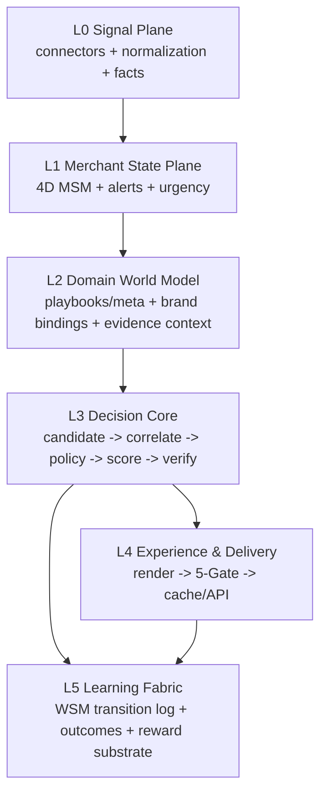
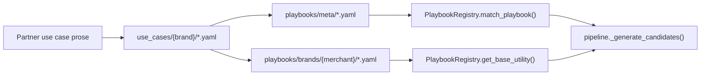

# V3 全局架构地图 + 可改/不可改边界表

**版本**: 2026-04-13
**适用范围**: V3 当前代码库实际实现状态
**用途**: 作为后续架构优化、代码重构、KG translation、数据接入、partner 协作的统一参照

---

## 1. V3 是什么

V3 不是 dashboard，不是 chatbot，也不是自动执行器。

V3 的产品本质是：

**一个面向 CPG / DTC 品牌的 Operating Intelligence Layer。**

它做四件事：

1. 接入商家经营信号并压缩为可路由状态。
2. 基于 KG、约束、评分和验证链生成候选决策。
3. 把通过验证的决策渲染为可审批的 merchant-facing card。
4. 把每一次推荐、执行、反馈、结果都写入 L5，作为未来学习层的 substrate。

它明确不做三件事：

1. 不在 Fast Plane 在线重算。
2. 不允许 LLM 决定动作。
3. 不绕过 merchant approval 直接执行高风险动作。

---

## 2. 当前仓库状态

截至 2026-04-13，本仓库的当前状态是：

- Phase 1 已完成，具备可运行的 Deep Plane 主链。
- 三层 KG 已接入默认 runtime，不再只是文档结构。
- Evidence Graph Snapshot 已进入主渲染路径。
- Feature Plane 已接入 candidate generation。
- API、Fast Plane、WSM、rollback、approval 主路径可跑。
- L0 真实 connector、真实 write API、真实 LLM API、真实训练层仍在 Phase 2/3。

当前验证状态：

- 全量测试：`383 passed, 67 warnings`
- 主运行编排：[pipeline.py](/Users/yubo/Documents/worksapce/Decision Engine/V3/src/decision_engine/layer4_serving/pipeline.py)
- 架构权威参考：[CLAUDE.md](/Users/yubo/Documents/worksapce/Decision Engine/V3/CLAUDE.md)
- 路线图：[docs/PHASE_ROADMAP.md](/Users/yubo/Documents/worksapce/Decision Engine/V3/docs/PHASE_ROADMAP.md)

---

## 3. 全局架构地图

### 3.1 逻辑全景

### 3.2 物理目录与概念层映射

| 概念层 | 主要职责 | 当前物理位置 |
|---|---|---|
| L0 Signal Plane | 接入、归一化、事实化，零决策逻辑 | `src/decision_engine/layer0_data/` |
| L1 Merchant State Plane | MSM 状态压缩、urgency、alert routing | `src/decision_engine/layer1_msm/` |
| L2 Domain World Model | KG/context/evidence world model | `src/decision_engine/layer2_decision/pillar1_kg/` |
| L2 ML pillar | anomaly / regression / bandit 占位与 Phase gate | `src/decision_engine/layer2_decision/pillar2_ml/` |
| L2/L3 过渡区 | verifier / renderer / safety gateway 仍在旧物理目录 | `src/decision_engine/layer2_decision/pillar3_llm/` |
| L3 Decision Core / Value | constraints / impact / approval / planner | `src/decision_engine/layer3_value/` |
| L4 Delivery | pipeline / fast plane / rollout / redis cache | `src/decision_engine/layer4_serving/` |
| L5 Learning Fabric | WSM / reward / telemetry 占位 | `src/decision_engine/layer5_wsm/` |

### 3.3 当前最重要的“架构真相”

V3 当前是一个“**概念层次清晰，但物理重构尚未完成**”的系统。

这意味着：

- 逻辑边界已经通过 ADR、contracts、tests 固化。
- 物理代码组织仍有 Phase 2 Track B 的历史遗留。
- 后续重构必须尊重概念边界，而不是被现有目录结构误导。

---

## 4. 主运行链路地图

### 4.1 Deep Plane 主链

真实入口：

- API 入口：[api/app.py](/Users/yubo/Documents/worksapce/Decision Engine/V3/api/app.py)
- 编排入口：[pipeline.py](/Users/yubo/Documents/worksapce/Decision Engine/V3/src/decision_engine/layer4_serving/pipeline.py)

当前 Deep Plane 的 16 步可以压缩为 8 个大块：

1. **信号加载**
   - 来源：传入 `signals` 或 DB 中最近一次 `metrics_snapshot`
   - 目标：得到当前运行需要的事实输入

2. **L1 MSM 计算**
   - 组件：[merchant_state_machine.py](/Users/yubo/Documents/worksapce/Decision Engine/V3/src/decision_engine/layer1_msm/merchant_state_machine.py)
   - 输出：`MerchantStateVector`
   - 关键点：先读 previous state，再 compute 并 upsert，新旧状态不会再混淆

3. **Alert / emergency routing**
   - 组件：[alert_engine.py](/Users/yubo/Documents/worksapce/Decision Engine/V3/src/decision_engine/layer1_msm/alert_engine.py)
   - 输出：`alerts` + `emergency_triggered`

4. **Policy + KG candidate proposal**
   - Policy 来源：DB 最新 policy，不存在则 LKG fallback
   - KG 来源：[playbook_registry.py](/Users/yubo/Documents/worksapce/Decision Engine/V3/src/decision_engine/layer2_decision/pillar1_kg/playbook_registry.py)
   - 输出：带 `constraints_result` 和 `feature_vector` 的 candidates

5. **Correlation + Scoring + Verification**
   - 组件：[scoring.py](/Users/yubo/Documents/worksapce/Decision Engine/V3/src/decision_engine/layer2_decision/scoring.py)
   - 内部顺序：
     - correlate
     - consume `PolicyDecision`
     - `DecisionVerifier`
     - score or `-inf`

6. **Evidence / Impact / Counterfactual**
   - Snapshot：[pipeline.py](/Users/yubo/Documents/worksapce/Decision Engine/V3/src/decision_engine/layer4_serving/pipeline.py)
   - Impact：[impact_calculator.py](/Users/yubo/Documents/worksapce/Decision Engine/V3/src/decision_engine/layer3_value/impact_calculator.py)
   - Counterfactual：top1 vs runner-up

7. **DecisionCard assembly + Render + 5-Gate**
   - Card contract：[contracts.py](/Users/yubo/Documents/worksapce/Decision Engine/V3/src/decision_engine/contracts.py)
   - Renderer：[llm_renderer.py](/Users/yubo/Documents/worksapce/Decision Engine/V3/src/decision_engine/layer2_decision/pillar3_llm/llm_renderer.py)
   - Safety：[llm_safety_gateway.py](/Users/yubo/Documents/worksapce/Decision Engine/V3/src/decision_engine/layer2_decision/pillar3_llm/llm_safety_gateway.py)

8. **WSM 持久化 + Weekly plan**
   - WSM 写入：[db_client.py](/Users/yubo/Documents/worksapce/Decision Engine/V3/src/decision_engine/db_client.py)
   - Weekly planner：[weekly_planner.py](/Users/yubo/Documents/worksapce/Decision Engine/V3/src/decision_engine/layer3_value/weekly_planner.py)

### 4.2 Fast Plane 主链

入口：[fast_plane.py](/Users/yubo/Documents/worksapce/Decision Engine/V3/src/decision_engine/layer4_serving/fast_plane.py)

它只做三件事：

1. 读 Redis cache。
2. Redis miss 时退 DB serving cache。
3. 可选 emergency reweight。

它明确不做：

1. 不调用 `pipeline.run_once()`
2. 不重新计算候选
3. 不重新跑验证链

这条边界是整个系统最关键的 runtime invariant 之一。

---

## 5. 关键数据对象地图

### 5.1 状态与特征

| 对象 | 角色 | 边界含义 |
|---|---|---|
| `MerchantStateVector` | L1 状态快照 | 路由状态，不是模型完整输入 |
| `DecisionState` | L1 typed routing state | 更抽象的离散状态契约 |
| `DecisionFeatureVector` | Feature Plane 数值特征 | 模型/Bandit 的 authoritative numeric contract |

### 5.2 决策链对象

| 对象 | 阶段 | 说明 |
|---|---|---|
| `RawCandidate` | L3.1 | 原始候选动作 |
| `PolicyDecision` | L3.3 | 约束结果唯一统一接口 |
| `ScoredCandidate` | L3.4 | 排序后候选 |
| `VerificationChain` | L3.5 | 决策验证链 |
| `EvidenceGraphSnapshot` | L3->L4 | 因果链封装对象 |
| `DecisionCard` | L4 | 对商家展示的标准卡片 |

### 5.3 为什么这些对象重要

这些对象不是“代码风格选择”，而是 V3 的真正骨架。

后续可以调整算法、阈值、数据源，但不应该轻易打散这些边界。否则系统会重新退回到 dict-driven spaghetti pipeline。

---

## 6. KG / Use Case / Policy / Data 的四条内容流

### 6.1 KG 内容流

### 6.2 Policy 流

- 来源：DB `planner_policy_pack` 或 `_lkg_policy()`
- 用途：
  - beta 权重
  - risk budget
  - vertical / version
- 不负责：
  - 不定义 CPG hard constraints
  - 不替代 KG

### 6.3 Data 流

- 现在：deterministic stub / test fixture / `metrics_snapshot`
- 未来：L0 connector normalization → MSM / FeatureBuilder / KG metrics

### 6.4 Learning 流

- 现在：L5 以 log substrate 为主
- 未来：
  - proxy reward
  - final reward
  - bandit update
  - calibration feedback into priors

---

## 7. 运行边界图

### 7.1 哪些是真正“在线主路径”

| 组件 | 当前是否在主路径 | 说明 |
|---|---|---|
| `MerchantStateMachine` | 是 | 每次 Deep Plane 必经 |
| `PlaybookRegistry` | 是 | 当前 KG runtime bridge |
| `ConstraintEngine` | 是 | 当前硬约束 authority |
| `ScoringEngine` | 是 | 当前排序 authority |
| `DecisionVerifier` | 是 | 当前逻辑安全壳 |
| `LLMRenderer.render_from_snapshot()` | 是 | 当前优先渲染路径 |
| `LLMSafetyGateway` | 是 | 当前 merchant copy QA |
| `FastPlane` | 是 | 当前对外低延迟读取平面 |

### 7.2 哪些仍是 Phase 2/3 占位

| 组件 | 当前状态 | 含义 |
|---|---|---|
| L0 connectors | stub | 真实数据接入尚未开始 |
| `RegressionModel` | stub | Phase 2 训练前不启用 |
| `LinUCBBandit` | stub | Phase 3 前不启用 |
| L5 `WSMClient` / `RewardBackfill` / `TelemetryAuditLogger` | mostly stub | 逻辑定位明确，但实现未填满 |
| DAGs | stub | 调度壳在，生产 DAG 未成型 |

---

## 8. 可改 / 不可改 / 条件性可改 边界表

## 8.1 不可改边界

这些不是“现在最好别改”，而是**改了就等于换产品定义**。

| 边界 | 当前定义 | 为什么不可改 | 违反后果 |
|---|---|---|---|
| Fast Plane 不重算 | `FastPlane` 只读 cache | 这是延迟 SLA 和控制面的基础 | 在线行为不可预测，架构退化 |
| L0 不放决策逻辑 | L0 只做 data factualization | 保持信号层可替换、可审计 | connector 污染决策逻辑 |
| MSM 不等于 feature vector | MSM 负责 routing，不是完整模型输入 | 这是 explainability 与 ML 解耦的基础 | 模型上下文被离散状态过度压缩 |
| ConstraintEngine 是 hard constraints authority | CPG safety 只能有一个源头 | 安全规则必须单点治理 | 多处漂移、规则冲突 |
| DecisionVerifier 在渲染前 | 先 verify，再 render | LLM 不能表达未验证决策 | 风险动作先说后拦，产品失真 |
| 5-Gate 在 merchant-facing copy 前 | copy 必须 QA 后才能见商家 | “正确决策”不等于“可安全表达” | 商家看到不合规表达 |
| WSM 写入是 pipeline invariant | Step 14/错误哨兵必须保留 | 学习层必须对成功与失败都留痕 | 无法回溯、无法学习 |
| Human approval before execution | 高风险动作不能绕过 merchant | 这是 B2B trust foundation | 从 recommendation 变成 unsafe automation |

## 8.2 可改边界

这些区域是你后续最适合持续优化的地方。

| 区域 | 当前 owner | 可以怎么改 | 改动性质 |
|---|---|---|---|
| `playbooks/meta/` | KG partner + architect | 新增/重构 meta-pattern、动作语义 | 内容扩展 |
| `playbooks/brands/` | architect | 品牌阈值、entity binding、prior | 内容校准 |
| `use_cases/` | partner 原始资产 | 新增品牌案例、校正 derivation | 证据沉淀 |
| `FeatureBuilder` | architect | 改特征抽取/默认值/日志策略 | 工程优化 |
| `ImpactCalculator` | architect | 从 benchmark 过渡到 real outcome | Phase 2 升级 |
| `CrossModuleCorrelator` | architect | 扩展 conflict rule | 决策策略增强 |
| `LLMRenderer` 模板 | architect | 优化表达、摘要方式、snapshot 消费 | 交付质量优化 |
| `BenchmarkEngine` | architect | 从 public benchmark 过渡到 multi-merchant peer | 商业化增强 |
| `PolicyPack` 内容 | ops / planner | beta、risk budget、priority 调整 | 运营调优 |

## 8.3 条件性可改边界

这些能改，但必须满足前提，不能“今天想改就改”。

| 区域 | 允许改动的前提 | 推荐时机 |
|---|---|---|
| L3 物理拆分 | 不改变 typed contracts 和 runtime semantics | Phase 2 Track B |
| renderer / safety gateway 迁移到 L4 | 同步更新 import 和 invariant tests | Phase 2 Track B |
| connector protocol + normalize facade | data partner ready，字段映射稳定 | Phase 2 Track A |
| 真实 LLM API integration | cost / fallback / safety gate 准备好 | Phase 2 Track A |
| external write APIs | approval / rollback / idempotency 完整 | First paid customer 前 |
| reward backfill 激活 | 有真实 `was_executed` 和 outcome 窗口 | Phase 2 后段 |
| bandit 激活 | 至少 6 个月高质量 action/outcome 数据 | Phase 3 |
| document compiler | use case 规模足够大，人工翻译成本过高 | Phase 3 |

---

## 9. 后续优化时的推荐切入顺序

如果你接下来让我真正动架构或代码，我会优先按这个顺序推进：

1. **不动产品定义，只收紧边界**
   - 补更强的 pipeline-level regression tests
   - 收敛文档和实现的一致性
   - 补 observability

2. **先做 Phase 2 的“接线工程”，不急着做学习层**
   - connector facade
   - signal contract
   - serving stale visibility
   - real outcome logging

3. **再做物理重构**
   - L3 split
   - renderer / verifier / bouncer 迁移
   - typed `CorrelatedCandidate`

4. **最后才做 learning activation**
   - reward backfill
   - calibration loop
   - bandit

---

## 10. 一句话总结

V3 当前已经是一套“**架构边界清楚、主链可运行、内容体系成型、学习层未激活**”的 Decision Engine。

你后续最应该保护的，不是某个目录结构，而是下面这条产品级 invariant：

**事实输入必须先被压成可解释状态，候选动作必须先经过规则和验证，再被表达给商家，最后无论成功失败都必须回写到学习底座。**

这条链，就是 V3 真正不可动摇的核心。
